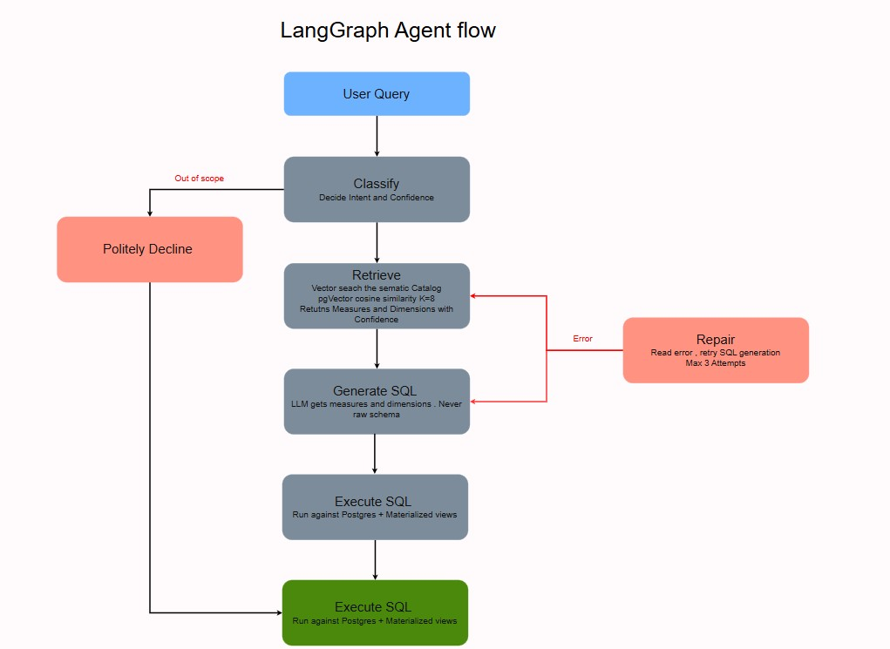

# Glass Box

**An auditable AI analytics platform that turns plain English questions into trustworthy answers, grounded in your data.**

---

## What is this

Glass Box is a full stack AI analytics platform. It connects an LLM to a Postgres database in a way you can actually trust in production. Users ask questions in plain English and get back narrative answers, charts, and the SQL the agent ran to produce them.

The reference build ships with the US Accidents dataset from Kaggle (7.7 million rows, 2016 to 2023) so you can see it working end to end without any setup beyond 'docker compose up'. The same architecture works against any data already sitting in Postgres, BW, S/4HANA, Snowflake, or anywhere else you can point an LLM with a semantic catalog.

It is called Glass Box because that is the inversion of black box. Every answer the AI gives is auditable. Click any answer in the chat and you see the SQL behind it, the catalog items it retrieved. Users cannot trust a black box. They can trust glass.

## Why this exists

Most AI dashboard demos give an LLM raw schema access and pray. The LLM looks at column names, guesses what they mean, sometimes gets it right, sometimes hallucinates a wrong answer with full confidence. This works as a demo. It does not work in production.

Glass Box was built to test a different thesis. Put a curated semantic layer between the LLM and the database. 


## Architecture Diagram


## Agent Workflow



## Key features

**Natural language to SQL, grounded in a semantic catalog**
The LLM never touches the raw schema. It queries against a curated catalog of certified measures, dimensions, and example values, indexed in pgvector for semantic search. 

**Self repairing SQL agent**
Built on LangGraph. Six specialist nodes: classify the question, retrieve relevant catalog items, generate SQL, execute it, repair on failure (up to three retries), narrate the result. Single shot LLM agents fail silently. This one recovers from errors and explains what went wrong if it cannot.

**Streaming responses with progressive rendering**
Server Sent Events stream each piece as soon as it is ready, so the user starts reading while compute happens. Frontend uses Microsoft fetch event source.

**Full SQL transparency**
Every AI answer ships with a "View SQL" expander. Click it, see the actual query. Verify any answer at any depth. This is the single most important UI decision in the product.

**Voice input**
Click the mic, speak the question, the OpenAI Whisper API transcribes it, and the question runs through the agent. No voice output by design. 

**Production grade auth**
JWT with argon2 password hashing. Self serve registration. Change password flow with current password verification. 

**Two distinct UI modes for two distinct jobs**
The Dashboard view is a split screen workspace. The Reports view is an editorial layout with dynamic headlines generated from the live data. Same backend, different storytelling.

**Dark mode, keyboard shortcuts, sticky chat input, auto focus**
The kind of polish that signals real product, not prototype. Cmd+K opens the AI panel from anywhere. Esc closes it. The input never scrolls out of view.

## Architecture at a glance

The system has four layers, each with one responsibility.

**Data layer.** Postgres holds the raw data and three layers of materialized views (monthly aggregates, weather aggregates, city aggregates). A measures and dimensions catalog sits on top, indexed in pgvector.

**Agent layer.** A LangGraph state machine with six nodes. State flows through the graph, each node either enriches it or routes to the next node based on the result.

**API layer.** FastAPI exposes REST endpoints for the dashboard and an SSE endpoint for the streaming chat. JWT auth on every protected route.

**UI layer.** React with Vite, TypeScript, Tailwind. Dashboard charts use Recharts. Chat streaming uses fetch event source. State managed by TanStack Query and React Context.


## Tech stack

| Layer | Technology |
|---|---|
| Database | Postgres 16, pgvector extension, HNSW index |
| Agent framework | LangGraph |
| LLM provider | OpenAI (gpt-4o for SQL and narration, gpt-4o-mini for classification, text-embedding-3-small for catalog embeddings, Whisper for voice) |
| API | FastAPI, sse-starlette, Pydantic 2 |
| Auth | JWT with python-jose, argon2 via passlib |
| Frontend framework | React 18, TypeScript, Vite |
| Styling | Tailwind 3 with shadcn pattern, CSS variable theming |
| Charts | Recharts |
| Data fetching | TanStack Query |
| Streaming | Microsoft fetch-event-source |
| Container | Docker Compose for local Postgres |

## Quickstart

You need Docker, Python 3.12, and Node 20 or higher.

```bash
# Clone and enter
git clone https://github.com/yourusername/glass-box.git
cd glass-box

# Start Postgres with pgvector
docker compose up -d

# Backend setup
python -m venv venv
source venv/bin/activate
pip install -r requirements.txt

# Configure environment
cp .env.example .env
# Edit .env and add your OPENAI_API_KEY

# Initialize the database (loads sample data, creates catalogs, seeds users)
python -m agent.scripts.setup_database

# Start the API (in one terminal)
uvicorn api.main:app --reload --port 8000

# Start the frontend (in another terminal)
cd frontend
npm install
npm run dev
```

Open http://localhost:5173 and sign in with the seeded credentials, or register a new account.

## Bringing your own data

The reference build uses Kaggle US Accidents data. To point Glass Box at your own data:

1. **Load your data into Postgres.** Any table or view works. The reference build assumes a flat fact table but the agent works against any shape.
2. **Define your measures catalog.** Edit `agent/scripts/seed_catalog.py` and add rows describing your metrics. Each measure has a name, a description, the SQL expression, and example questions.
3. **Define your dimensions catalog.** Same file. List the columns that make sense to group by, with a description and example values.
4. **Re-run the embedding script.** `python -m agent.scripts.ingest_semantic_index` will regenerate the pgvector embeddings.
5. **Update the dashboard endpoints.** `api/services/dashboard_service.py` has the queries that power the static dashboard. Adapt these to your data.

The agent layer (LangGraph nodes), the auth layer, and most of the frontend require no changes.

## How the agent works

When you send a question, here is what happens.

```
Your question
   |
   v
+----------+
| Classify | -> Decides intent: metric_lookup, comparison, trend, out_of_scope, ambiguous
+----------+
   |
   v
+----------+
| Retrieve | -> Vector search against semantic_index, returns top K matching catalog items
+----------+
   |
   v
+----------+
|GenerateSQL| -> LLM writes Postgres SQL using catalog items, not raw schema
+----------+
   |
   v
+----------+
| Execute  | -> Runs against Postgres
+----------+
   |
   |--- success ---v
   |              +----------+
   |              | Narrate  | -> LLM generates exec language explanation
   |              +----------+
   |                   |
   |                   v
   |              You see narrative + chart + SQL + followups
   |
   |--- failure ---v
                  +----------+
                  | Repair   | -> Sends error back to LLM, retries (max 3 times)
                  +----------+
                       |
                       v
                  Back to Execute or graceful failure message
```

Each node is a small Python function in `agent/nodes/`. The graph definition is in `agent/graph.py`. The state object that flows through is in `agent/state.py`.

## What this is not

This is a POC. To be honest about what is missing if you wanted to actually deploy it:

- No multi tenant data isolation. One database, one set of users, one OpenAI API key.
- No row level security. The agent can theoretically query anything in the database.
- No SOC 2 or HIPAA controls. Logs include user questions in plain text.
- No production rate limiting or cost controls beyond what OpenAI's platform provides.
- No real PII in the reference data. The Kaggle dataset is publicly available accident records.

These are weeks of work each, not days. They are tractable but not done.

## Project structure

```
glass-box/
├── agent/                  # LangGraph agent
│   ├── nodes/              # Six specialist nodes
│   ├── graph.py            # Graph wiring
│   ├── state.py            # Agent state schema
│   ├── prompts.py          # All LLM prompts in one place
│   └── scripts/            # Setup, ingestion, testing scripts
├── api/                    # FastAPI backend
│   ├── routers/            # /auth, /dashboard, /chat
│   ├── services/           # Business logic
│   ├── models/             # Pydantic schemas
│   └── security.py         # JWT and password hashing
├── frontend/               # React app
│   ├── src/
│   │   ├── components/     # UI components
│   │   ├── contexts/       # Auth, Theme, Year, Rail providers
│   │   ├── hooks/          # useChatStream, useVoiceRecorder
│   │   ├── lib/            # API client, types, formatters
│   │   └── pages/          # Login, Register, Dashboard, Reports
│   └── tailwind.config.js
├── docs/                   # Architecture diagrams, design notes
├── docker-compose.yml      # Local Postgres with pgvector
└── requirements.txt
```

## Roadmap

Things I would build if I keep going.

- Forecasting node that projects trends forward with confidence intervals
- Row level security tied to user roles
- A proper deployment story (Docker for backend, static hosting for frontend, hosted Postgres)
- Multi tenant isolation
- Slack and email integration for daily briefings

## Why I built this

I have spent 14 years inside SAP systems. I wanted to find out where AI actually amplifies an experienced engineer, and where it does not. The answer surprised me. AI was excellent at the inside of every layer (writing the React components, debugging TypeScript, generating test data) and useless at the boundaries between layers (deciding what should be a materialized view, designing the agent state, choosing transparency over wow). The architecture remains a human discipline. AI just made the typing faster.


## License

MIT. Use it however you want. If you build something interesting on top, I would love to hear about it.

## Acknowledgements

- US Accidents dataset by Sobhan Moosavi on Kaggle
- LangGraph by the LangChain team
- The shadcn/ui component patterns
- Inter font by Rasmus Andersson
